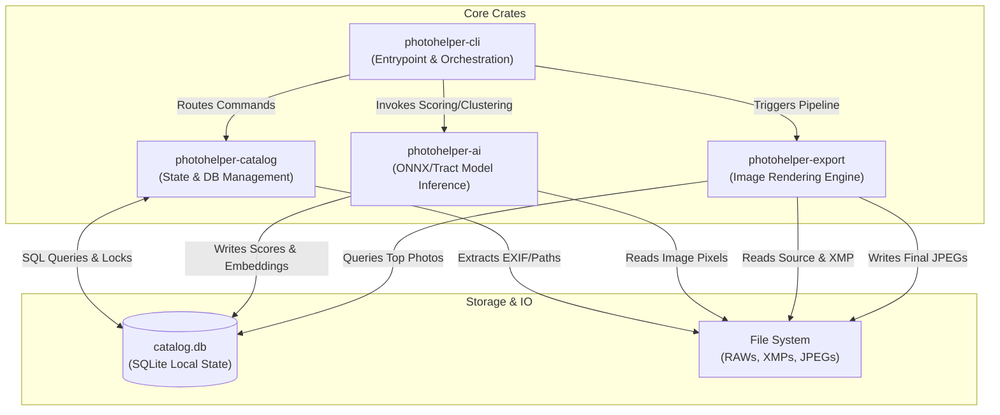
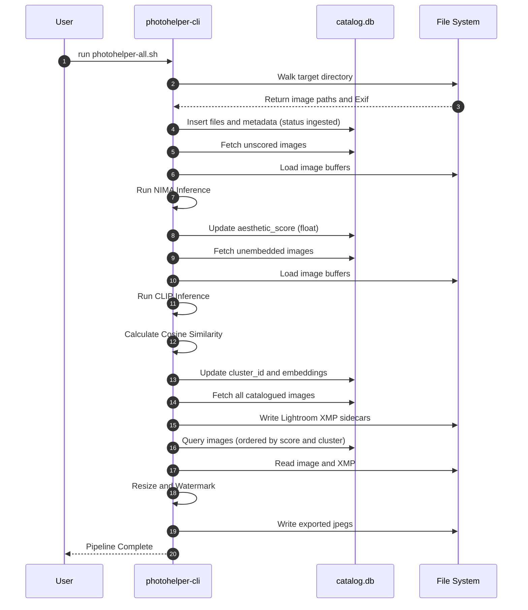

# Photohelper Architecture

Photohelper is an AI-powered, high-performance CLI tool built in Rust for automating the photography post-production pipeline. It handles everything from ingesting RAW files to AI-driven aesthetic culling, semantic deduplication, Lightroom-compatible XMP generation, and watermarked JPEG exports.

## 1. High-Level System Architecture

The system is organized into modular Rust crates, communicating with a central SQLite catalog that acts as the source of truth for the entire pipeline.

## 2. Core Components

*   **photohelper-cli**: The command-line interface built with `clap`. It orchestrates the pipeline steps (`ingest`, `cull`, `dedup`, `develop`, `export`, `run`).
*   **photohelper-catalog**: Manages the local `.photohelper/catalog.db` SQLite database. It handles database migrations, schema definitions, file-system walking, and EXIF metadata extraction.
*   **photohelper-ai**: Encapsulates the machine learning models.
    *   **NIMA (Neural Image Assessment)**: Used during the `cull` step to assign aesthetic float scores (e.g., `5.87`) to each photo.
    *   **CLIP (ViT-B/32)**: Used during the `dedup` step to generate semantic embeddings and calculate cosine-similarity for grouping similar photos into clusters.
*   **photohelper-export**: The rendering engine. It reads RAW/JPEG files, applies basic development settings, enforces long-edge resizing constraints, overlays watermarks, and writes the final output files based on the smart naming convention.

## 3. Pipeline Sequence Flow

The core power of Photohelper is its automated sequential pipeline. Here is how data flows from a raw folder of images to a curated, exported gallery.

## 4. Data Model (SQLite)

The local SQLite catalog (`catalog.db`) ensures the tool can resume if interrupted and avoids re-processing files that haven't changed.

**Table:** `photos`
*   `id` (INTEGER PRIMARY KEY)
*   `path` (TEXT UNIQUE): Relative path to the image.
*   `file_size`, `mtime` (INTEGER): For cache invalidation.
*   `width`, `height` (INTEGER): Extracted dimensions.
*   `aesthetic_score` (REAL): The NIMA AI score (e.g. `5.67`).
*   `cluster_id` (INTEGER): Group ID from the deduplication step.
*   `clip_embedding` (BLOB): The semantic vector array.
*   `status` (TEXT): Enum tracking pipeline progress (`ingested`, `scored`, `embedded`, `errored`).

## 5. File Naming & Grouping Strategy

To facilitate native OS sorting (like macOS Finder), Photohelper exports files using a strict naming taxonomy injected during the `export` phase:

Format: `[cluster-XXX-]cull-[XX.XX]-[raw-filename].jpg`
*   **Cluster**: Similar photos grouped by the Dedup phase get a prefix like `cluster-026-`.
*   **Cull**: Padded float representation (`cull-05.87-`) ensures alphabetical sorting aligns with quality descending.
*   **Raw Name**: The original stem `_MG_9912.jpg` is preserved at the tail for traceability.

When sorted alphabetically in Finder, this ensures clusters are grouped together, and inside the cluster, the absolute best AI-rated photo is positioned at the top.
